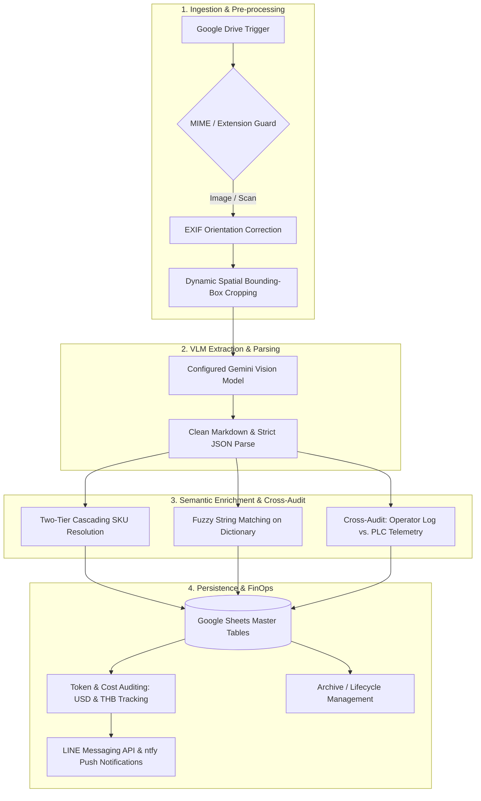

# Manufacturing Document OCR & Validation Workflows

[](https://n8n.io/)
[](https://ai.google.dev/)
[](https://developer.mozilla.org/)
[](https://developers.google.com/)
[](https://developers.line.biz/)

Five n8n workflows extract manufacturing quality and downtime records from scanned forms, reconcile product dictionaries, and write structured results to Google Sheets.

---

## 📌 Repository Structure

```text
industrial-vision-ocr/
├── README.md
└── workflows/
    ├── qc-defect-inspection-parser.json
    ├── qc-dimension-measurement-parser.json
    ├── qc-multi-region-defect-parser.json
    ├── machine-breakdown-downtime-audit.json
    └── qc-pallet-nonconforming-parser.json
```

---

## 📂 Workflow Catalog & Responsibilities

| Standardized Workflow Name | Source Workflow | Document Type / Domain | Key Technical Mechanisms |
| :--- | :--- | :--- | :--- |
| `qc-defect-inspection-parser.json` | `FM-DQM-002` | In-line Defect QC Report | 5-stage sequential VLM extraction, two-tier SKU lookup, batch writing to 4 target sheets. |
| `qc-dimension-measurement-parser.json` | `tpi-ocr-docs-003` | Dimension & Weight Metrology | Multi-section parallel VLM agents, product spec resolution, weight and wall-thickness grid mapping. |
| `qc-multi-region-defect-parser.json` | `tpi-ocr-docs-004` | Hourly Visual Inspection Sheet | EXIF orientation auto-rotation, dynamic 7-zone bounding box image cropping, daily LINE briefing. |
| `machine-breakdown-downtime-audit.json` | `tpi-ocr-docs-015` | Machine Downtime Log | Multi-part sheet pairing (`#1/#2`), fuzzy cause matching, automated alignment with PLC alarms ($\Delta t \le 1\text{ min}$). |
| `qc-pallet-nonconforming-parser.json` | `tpi-ocr-docs-018` | Pallet Defect Inspection Log | 30-row dense table extraction, non-zero defect compression, auto-calculation of total defective weight. |

---

## ⚙️ Core Technical Capabilities



### 1. Spatial Cropping & Hardware Normalization
* **Sub-Image Bounding-Box Cropping:** Deconstructs dense multi-table physical sheets into isolated regions using dynamic pixel coordinates $(x, y, w, h)$, reducing neighboring-row interference while optimizing token usage.
* **Buffer-Level EXIF Rotation:** Parses binary image buffers directly to extract TIFF/EXIF orientation tags, automatically rotating skewed captures ($90^\circ, 180^\circ, 270^\circ$) before passing them to the VLM.

### 2. Semantic Lookups & Ground-Truth Alignment
* **Two-Tier Fallback Search:** Resolves handwritten abbreviations and degraded text first against active production run lists, falling back to comprehensive SKU dictionaries.
* **Closed-Loop Downtime Verification:** Correlates handwritten downtime causes with automated machine alarms by matching timestamps within a $\pm 1\text{-minute}$ threshold, segregating human feedback from PLC telemetry.

### 3. FinOps & Operational Monitoring
* **Real-Time Token & Cost Metering:** Extracts `usageMetadata` (input, candidate, and thought tokens) from every API call, calculating per-document costs based on tier pricing and logging metrics to a central cost ledger.
* **Multi-Channel Alerting:** Dispatches execution summaries via LINE Messaging API and critical error triggers via `ntfy.sh` with full stack traces.

---

## 🚀 Setup & Usage

1. **Clone the repository:**
   ```bash
   git clone https://github.com/Panutle/industrial-vision-ocr.git
   cd industrial-vision-ocr
   ```
2. **Import to n8n:**
   * Open your n8n web interface.
   * Go to **Workflows** > **Import from File**.
   * Import each `.json` file from the `workflows/` directory.
3. **Configure Credentials:**
   * **Google Drive / Google Sheets OAuth2:** Attach accounts with access to source image folders and destination spreadsheets.
   * **Google Gemini API:** Provide an API key via the Google Palm / Gemini node configuration.
   * **LINE Messaging API:** Set up channel access tokens for success notifications.


## Reproduction notes

This repository contains workflow exports. The source spreadsheets, operational datasets, credentials, and connected services must be supplied separately.

1. Import the JSON files with the workflows inactive and resolve any unavailable node types.
2. Rebind credential references to accounts in your own n8n instance.
3. Replace document IDs, sheet names, folder IDs, webhook endpoints, LINE recipient IDs, and embedded configuration in both Code and HTTP Request nodes. Credential binding alone is not enough.
4. Match sheet headers and data types to the field names read by the workflow; there is no automatic source-schema provisioning.
5. Run a representative input against test destinations and inspect the extracted records or generated plan. Verify the workflow timezone and alert recipients before enabling schedules.

Use an n8n installation that supports the exported Gemini, Data Table, and Edit Image nodes. Recreate the referenced Data Tables, select a Gemini model available to your account, and review the cost tables in Code nodes; their model names and prices are configuration, not a current pricing reference.

The exports demonstrate implementation choices; this repository does not include a reproducible benchmark for accuracy, time savings, or production availability.
